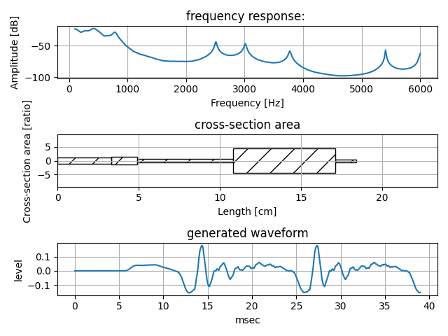
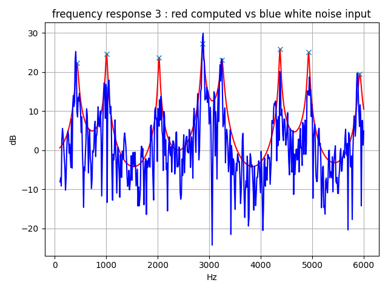
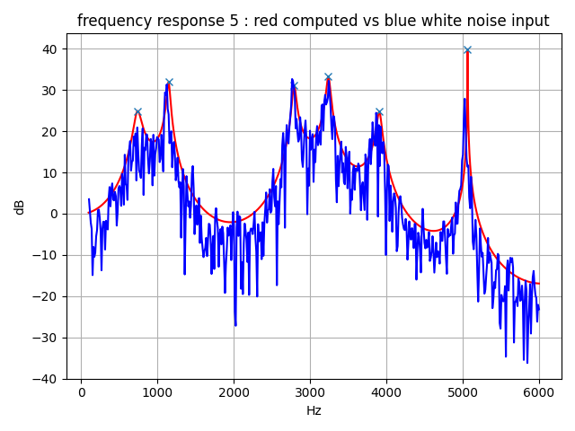

# vocal tract tube model 2   

Python Class to calculate frequecny response and process reflection transmission of resonance tube.  
There are two, three, four, and five tube model.  


## generate waveform using tube model  

Draw frequency response, cross-sectional view (area), and waveform, considering glottal voice source and mouth radiation. save generated waveform as a wav file.  

```
python main5.py --osratio [number]  
```
In order to reduce digitize error of tube delay time, high sampling rate is recommended. 
osratio means over sampling ratio. Defalut value is 4 and sampling rate of process is 192000Hz (=48000Hz x 4).  

Example of five tube model: tube_5p1  
  
Example of five tube model: tube_5p2  
  
Example of five tube model: tube_5p3  
  
Example of five tube model: tube_5p4  
  
Example of five tube model: tube_5p5  
  

There are above wav files in generated_waveform folder.    


## tube model check of frequency response    

Comparison computed frequency response to white noise input frequency response using FFT analysis.  

```
python tubecheck.py
```
Example of two tube model  
  
Example of three tube model  
  
Example of four tube model  
  
Example of five tube model  
  


## License    
MIT  
